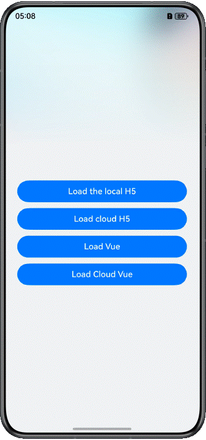
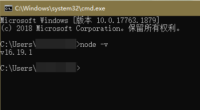
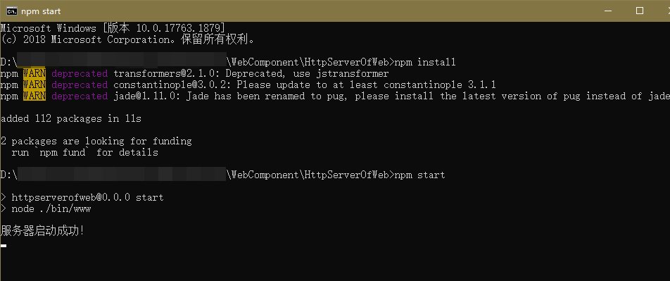
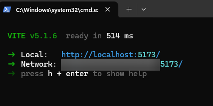

# Web Lucky Draw Case

## Introduction

This codelab gives an example of ArkTS declarative development, introducing how the **Web** component loads H5 or Vue pages on the local or cloud server.



## Concepts

- Web: displays web pages.
- runJavaScript: runs a JavaScript script. This API uses an asynchronous callback to return the script execution result.

## Permissions

**ohos.permission.INTERNET**, required for accessing online web pages.

## How to Use
#### Preview device description
The previewer does not support previewing web components. Please run it on a real machine.

#### Server setup process

1. Set up the Node.js environment. The server in this codelab is implemented based on Node.js. You need to install Node.js. If you already have a Node.js environment, skip this step.
   1. Check whether Node.js is installed on the local PC. Open the command line tool (for example, **cmd** in Windows or **Terminal** in the macOS. Windows is used here). Enter the **node -v** command. If the version information is displayed, Node.js has been successfully installed.
      
   2. If you do not have the Node.js environment on your local PC, download the required version from the Node.js official website and install it.
   3. After the environment variables are configured, open the command line tool again and enter **node -v**. If the version information is displayed, the installation is successful.
2. Run the server code.
   1. Run the H5 server code. Open the command line tool in the **HttpServerOfWeb** directory of this project, enter **npm install** to install the server dependency package. If the installation is successful, enter **npm start** and press **Enter**. If you see message "The server is started successfully", the server is running properly.
   
   2. Run the Vue server code. Open the command line tool in the **HttpServerOfVue** directory of this project, enter **npm install** to install the server dependency package. If the installation is successful, enter **npm run dev** and press **Enter**. If a link is displayed, the server can be started normally.
   
3. Build a LAN environment: When testing this codelab, ensure that the PCs for running the server code and testing are connected to the same LAN. You can enable your personal hotspot on your mobile phone, and then connect both PCs to your mobile phone hotspot for testing.
4. Connect to the server address: Open the command line tool, run the **ipconfig** command to view the local IP address, and copy the local IP address to the **entry/src/main/ets/common/Constant.ets** file. If the H5 server is running, modify the **CLOUD_PATH** variable. If the Vue server is running, modify the **VUE_CLOUD_PATH** variable. Note that only the IP address needs to be replaced. Do not change the port number. After saving the IP address, run the codelab to perform the test.

#### Frontend instructions

1. There are four buttons on the app home page, which are used for loading H5 or Vue pages on the local or cloud server respectively. The **Web** component loads the lucky draw page.
2. The lucky draw page consists of the Lucky Draw button and **Web** component. Bind a tap event to the Lucky Draw button to call the related function of the H5/Vue page, which returns the lucky draw result through **runjavascript** and displays the result in a dialog box on the page.
3. Tap the back button to return to the app home page.

#### H5/Vue code description

1. When loading local H5 pages, you do not need to perform other operations. The **Web** component directly reads the H5 resources in **entry/src/main/resource/rawfile/local**.
2. When loading cloud H5 pages, you need to run the H5 server according to the server setup process in the previous section.
3. When loading local Vue pages, you need to package the Vue project in the **HttpServerOfVue** directory. The **Web** component can load only static resources and cannot directly run the packaged Vue file. You need to modify the packaged **index.html** file.
   1. Change `<script src="./public/communication.js"></script>` to `<script src="./communication.js"></script>`.
   2. Add a `<script>` tag. The content is as follows:

```typescript
    <script>
      (function (win) {
        let scripts = document.getElementsByTagName('script')
        for(let i = 0; i < scripts.length; i++) {
          let script = scripts[i]
          let url = script.getAttribute("src")
          let type = script.getAttribute("type")
          let scriptText = script.innerHTML
          if (url || type === "module") {
            let tag=document.createElement('script');
            tag.setAttribute('url',url);
            tag.innerHTML = scriptText
            script.remove()
            document.getElementsByTagName('head')[0].appendChild(tag)
          }
        }
      })(window)
    </script>
```

4. When loading cloud Vue pages, you need to run the Vue server according to the server setup process in the previous section.

## Constraints

1. The sample is only supported on Huawei phones with standard systems.

2. HarmonyOS: HarmonyOS 5.0.5 Release or later.

3. DevEco Studio: DevEco Studio 6.0.0 Release or later.

4. HarmonyOS SDK: DevEco Studio 6.0.0 Release SDK or later.
