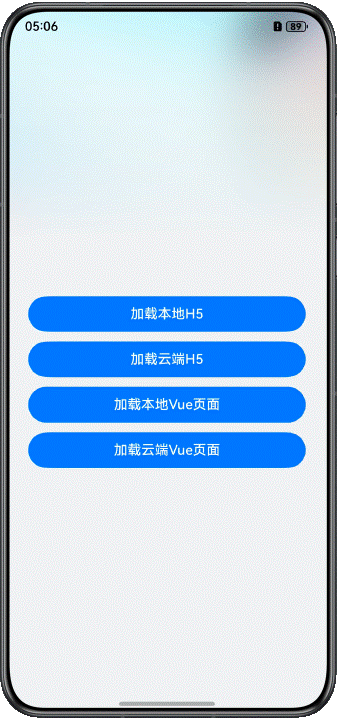

# 基于Web组件实现随机抽奖功能

## 简介

本篇Codelab是基于ArkTS的声明式开发范式的样例，主要介绍了Web组件如何加载本地、云端的H5和Vue页面。



## 相关概念

- Web：提供具有网页显示能力的Web组件。
- runJavaScript：异步执行JavaScript脚本，并通过回调方式返回脚本执行的结果。

## 相关权限

访问在线网页时需添加网络权限：ohos.permission.INTERNET。

## 使用说明
#### 预览器说明
预览器不支持预览Web组件，请使用真机运行。

#### 服务端搭建流程

1. 搭建nodejs环境：本篇Codelab的服务端是基于nodejs实现的，需要安装nodejs，如果您本地已有nodejs环境可以跳过此步骤。
   1. 检查本地是否安装nodejs：打开命令行工具（如Windows系统的cmd和Mac电脑的Terminal，这里以Windows为例），输入node -v，如果可以看到版本信息，说明已经安装nodejs。
      
   2. 如果本地没有nodejs环境，您可以去nodejs官网上下载所需版本进行安装配置。
   3. 配置完环境变量后，重新打开命令行工具，输入node -v，如果可以看到版本信息，说明已安装成功。
2. 运行服务端代码：
   1. 运行H5服务端代码。在本项目的HttpServerOfWeb目录下打开命令行工具，输入npm install 安装服务端依赖包，安装成功后输入npm start点击回车。看到“服务器启动成功！"则表示服务端已经在正常运行。
   
   2. 运行Vue服务端代码。在本项目的HttpServerOfVue目录下打开命令行工具，输入npm install 安装服务端依赖包，安装成功后输入npm run dev点击回车。看到输出链接，则表示服务端已经可以正常启动了。
   
3. 构建局域网环境：测试本Codelab时要确保运行服务端代码的电脑和测试机连接的是同一局域网下的网络，您可以用您的手机开一个个人热点，然后将测试机和运行服务端代码的电脑都连接您的手机热点进行测试。
4. 连接服务器地址：打开命令行工具，输入ipconfig命令查看本地ip，将本地ip地址复制到entry/src/main/ets/common/Constant.ets文件中，如果运行H5服务端，则修改CLOUD_PATH变量，如果运行Vue服务端，则修改VUE_CLOUD_PATH变量。注意只替换ip地址部分，不要修改端口号，保存好ip之后即可运行Codelab进行测试。

#### 前端使用说明

1. 点击应用进入主页面，页面提供四个按钮，分别对应加载本地H5，加载云端H5，加载本地Vue，加载云端Vue，点击按钮跳转到抽奖页面，Web组件会加载抽奖页面。
2. 抽奖页面主要是由“点击抽奖”按钮和Web组件构成。给“点击抽奖”按钮绑定点击事件，实现点击按钮调用H5/Vue页面的抽奖函数，并且通过runjavascript返回抽奖结果，在页面上弹窗显示。
3. 点击返回键，回到应用主页面。

#### H5/Vue代码使用说明

1. “加载本地H5”时，无需其他操作，Web组件会直接读取entry/src/main/resource/rawfile/local中的H5资源。
2. “加载云端H5”时，需要按照上一章节服务端搭建流程运行H5服务端。
3. “加载本地Vue”时，需要打包HttpServerOfVue目录中的Vue项目，Web组件只能加载静态资源，不能直接运行打包后的Vue文件，需要修改打包后的index.html文件。
   1. 将`<script src="./public/communication.js"></script>` 更改为`<script src="./communication.js"></script>`
   2. 增加一个`<script>`标签，内容为：

```typescript
    <script>
      (function (win) {
        let scripts = document.getElementsByTagName('script')
        for(let i = 0; i < scripts.length; i++) {
          let script = scripts[i]
          let url = script.getAttribute("src")
          let type = script.getAttribute("type")
          let scriptText = script.innerHTML
          if (url || type === "module") {
            let tag=document.createElement('script');
            tag.setAttribute('url',url);
            tag.innerHTML = scriptText
            script.remove()
            document.getElementsByTagName('head')[0].appendChild(tag)
          }
        }
      })(window)
    </script>
```

4. “加载云端Vue”时，需要按照上一章节服务端搭建流程运行Vue服务端。

## 约束与限制

1. 本示例仅支持标准系统上运行，支持设备：华为手机。
2. HarmonyOS系统：HarmonyOS 5.0.5 Release及以上。
3. DevEco Studio版本：DevEco Studio 6.0.0 Release及以上。
4. HarmonyOS SDK版本：HarmonyOS 6.0.0 Release SDK及以上。
